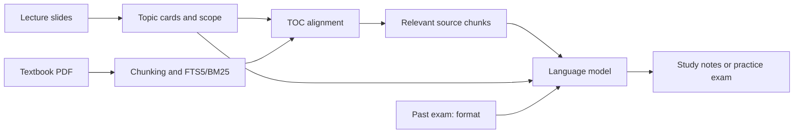
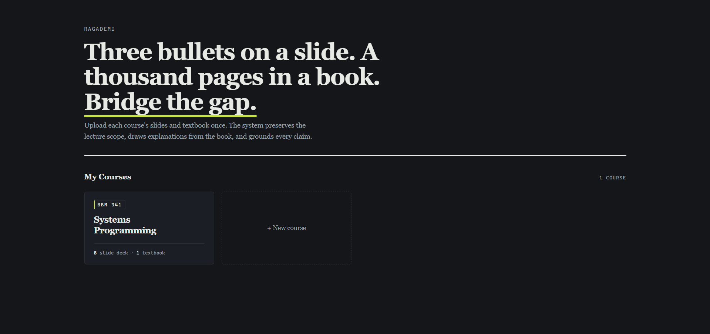
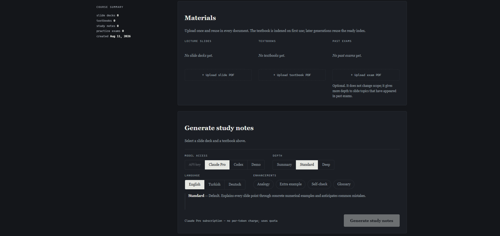
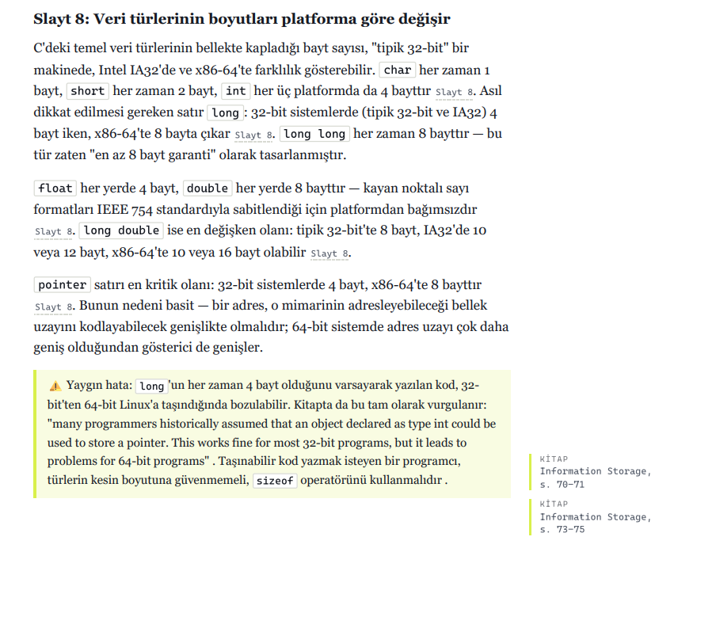

# RAGademi

> Source-Grounded Intelligent Study Note and Practice Exam Generation System

RAGademi combines lecture slides with textbooks to produce study notes that can
teach the material independently. Slides preserve the **course scope**, while the
textbook supplies detailed explanations and factual grounding. When a past exam is
provided, it guides question format and difficulty without expanding the scope.

## What it does

Upload a lecture PDF and a textbook PDF to generate a document containing:

- Expanded explanations for each topic in the slides
- Book citations in `[B: section, p. page]` format
- Relevant diagrams from the lecture slides
- Numbered textbook figures cropped directly from the source pages
- LaTeX mathematics rendered with KaTeX
- Syntax-highlighted code
- Optional analogies, examples, self-check questions, and a glossary
- Output in the selected language

If a claim cannot be supported by the provided sources, the system marks the
missing context instead of presenting invented information as grounded fact.

## RAG architecture



1. **Retrieve:** Local BM25 search finds the textbook chunks most relevant to
   each topic. TOC alignment first narrows the search to the likely page range.
2. **Augment:** Retrieved chunks are combined with slide scope, source locations,
   and generation rules.
3. **Generate:** The model creates grounded content, and internal source markers
   become visible citations in the final document.

The entire textbook is never sent to the model. TOC alignment, prompt caching,
multimodal processing, failure recovery, and persistence are documented in
[Architecture](docs/architecture.md).

## Screenshots

### Course workspace

Create courses and keep their slide decks, textbooks, past exams, and generated
documents in one reusable workspace.



### Generation settings

Choose the model backend, output language, explanation depth, and optional
enhancements before generating a document.



### Source-grounded output

Generated notes combine expanded explanations with inline slide references and
book citations. This example uses Turkish output to demonstrate multilingual
generation; the application interface remains in English.



## Installation

Windows PowerShell, with the virtual environment at the repository root:

```powershell
python -m venv .venv
.\.venv\Scripts\python.exe -m pip install -e ".[dev]"
.\.venv\Scripts\python.exe -m playwright install chromium
.\.venv\Scripts\python.exe scripts\vendor_katex.py
```

Optionally copy `.env.example` to `.env` and provide `ANTHROPIC_API_KEY`.
The application can run without credentials by falling back to the demo backend.

To use a ChatGPT/Codex subscription, install Codex CLI, run `codex login`, and
complete the browser sign-in. Verify the session with `codex login status`.
On Windows, RAGademi checks `RAGADEMI_CODEX_PATH`, the normal `PATH`, and then
the Codex executable bundled with the latest OpenAI VS Code or VS Code Insiders
extension. This means the web application can use Codex even when typing
`codex` directly in PowerShell reports that the command was not found.

## Running the application

```powershell
.\.venv\Scripts\python.exe -m dersnotu.cli serve
```

Open <http://127.0.0.1:8000>. Create a course, upload its slides, textbook, and
optionally a past exam, then choose the materials when generating a document.

Materials are content-addressed: adding the same textbook to multiple courses
does not duplicate the file or rebuild its index.

Each material area accepts multiple PDFs in one selection or by drag and drop.
Generated study notes and practice exams are private by default. Use **Publish**
on an individual document to add its PDF to `/public`, then **Copy link** to
share it. **Make private** removes it from the public page and blocks that link.
The uploaded source PDFs are never exposed by the public endpoints.

## Publish as a website

### Deploy free with Render, Supabase and Vercel

Render Free runs the complete FastAPI application using a temporary working
directory. Supabase Free keeps library metadata in PostgreSQL and uploaded
PDFs plus generated documents in a private Storage bucket. Vercel forwards
the website's requests to Render so the browser uses one origin for the UI
and API. No paid Render service or persistent Render disk is needed.

1. Create a Supabase Free project and a **private** bucket named `ragademi`.
   Copy the PostgreSQL **Session pooler** URL, and Storage S3 endpoint,
   region and generated key pair. Follow [the full setup guide](docs/deploy-free.md).
2. Push the project to GitHub. In Render, choose **New → Blueprint**, select
   the repository, and apply `render.yaml`. Fill in its cloud connection
   variables and a long, unique `DERSNOTU_ADMIN_PASSWORD`. The Blueprint uses
   the **free** compute plan in Frankfurt, without a persistent disk.
   Set `ANTHROPIC_API_KEY` for real API generation or leave it empty for demo
   output. The container does not include a signed-in subscription CLI session.
3. Wait for Render to finish deploying, then copy the service's HTTPS URL, for
   example `https://ragademi-example.onrender.com`.
4. In Vercel, import the same GitHub repository. Set the Framework Preset to
   **Other**. The `vercel.json` file routes all requests to
   `https://ragademi.onrender.com`; no Vercel environment variables are required.
   If your Render URL changes, update the destination in that file. Deploy the project.
5. Open the Vercel deployment URL. The owner interface asks for username
   `admin` and the password configured in Render. Public documents are at
   `/public`; only documents you publish there are visible without signing in.
6. If you own a domain, add it to the Vercel project and follow Vercel's DNS
   instructions. Visitors can then use that domain instead of the generated
   Vercel URL.

Supabase Free allows 1 GB of files, a 500 MB database, and 50 MB per file. Render
Free sleeps when idle and has 512 MB RAM; it can interrupt an unfinished run.
Completed documents remain in Supabase. The course page reconnects progress
streams and polls active job status to recover Vercel proxy interruptions.
Vercel's maximum proxy request duration is 120 seconds; use Render's URL
directly if a long request is interrupted. Free hosting does not cover model
API charges. See the guide for current quota references and a read-only
preflight/import tool for an existing local library.

### Deploy on a VPS with Docker Compose

The included Docker Compose setup runs RAGademi behind Caddy with HTTPS and a
persistent data volume. It is designed for a VPS or other host with Docker
Compose, a domain, and inbound ports 80 and 443.

1. Point your domain's DNS A/AAAA record to the host.
2. Copy `.env.example` to `.env`. Set `DOMAIN` and a long, unique
   `DERSNOTU_ADMIN_PASSWORD`. Set `ANTHROPIC_API_KEY` if you want real model
   output on this server; demo mode needs no key.
3. Run `docker compose up -d --build` from the repository directory.
4. Open `https://<your-domain>/` and sign in as `admin` with that password.
   The public gallery at `https://<your-domain>/public` needs no sign-in.

The owner password protects courses, source PDFs, generation, downloads, and
deletion. Public visitors can see and open only PDFs that you explicitly
publish. Check the rights to share text and figures in a generated document
before publishing it. The `/data` Docker volume holds the SQLite library,
uploads, indexes, and generated files; include this volume in backups. There
are no visitor accounts or public uploads in this version.

Before generation, the interface estimates section count, tokens, cost, and
duration. Duration estimates calibrate themselves from previous runs. For
subscription-based execution, the interface reports quota rather than a false
per-token price.

Generated notes can be read inside the application with the same rendering used
for PDF output. Search spans every note in the course and links directly to the
matching section.

### Model backends

| Backend | Authentication | Cost |
|---|---|---|
| `api` | `ANTHROPIC_API_KEY` | Token-based API cost |
| `cli` | Claude Pro/Max session through the `claude` command | Subscription quota |
| `codex` | ChatGPT/Codex subscription through `codex login` | Subscription quota |
| `demo` | None | Free `FakeLLMClient` |
| `auto` | Automatic | Tries `api → cli → codex → demo` |

Subscription CLI backends start a separate process for each model call and may be
slower than the direct API.

## Commands

`build`, `practice`, and `retry` may call a model. Indexing, search, preview,
rendering, and estimation run locally.

```powershell
dersnotu inspect  <lecture.pdf>                         # Segment slides into sections
dersnotu index    <book.pdf>                            # Build FTS index and scan figures
dersnotu search   <book.pdf> "query" --show             # Inspect retrieval quality
dersnotu estimate <lecture.pdf> <book.pdf>              # Estimate tokens, cost, and time
dersnotu preview  <lecture.pdf> <book.pdf> -s 1         # Show the exact model request
dersnotu render                                          # Render the built-in sample
dersnotu build    <lecture.pdf> <book.pdf> --depth deep -e quiz
dersnotu build    <lecture.pdf> <book.pdf> --backend codex
dersnotu practice <lecture.pdf> <book.pdf> <exam.pdf> -n 10 --pdf
dersnotu retry    <doc.json> <lecture.pdf> <book.pdf>   # Retry only failed sections
```

The CLI uses English option values:

- Depth: `summary`, `standard`, `deep`
- Extras: `analogy`, `example`, `quiz`, `glossary`

Legacy Turkish aliases are still accepted for backward compatibility, but all
documentation, examples, and generated commands use the English values above.

## How it works

```text
parse lecture ─┐
               ├─ build topic cards in one inexpensive model call
load book index┤
               ├─ align topics to the textbook TOC
               └─ per section: retrieve → expand
                                      ↓
                              Markdown → HTML → PDF
```

The architecture is driven by an asymmetry: lectures are small and visual, while
textbooks are large and mostly textual. The lecture text and selected diagram
slides may reach the model. The book is indexed locally with SQLite FTS5, and
only retrieved excerpts are included in model requests.

Book indexes are stored by content hash under `.cache/book-<sha>.sqlite` and are
reused across courses.

A failed section does not invalidate the whole document. It remains visible as a
warning, other sections continue, and only the failed sections are retried later.
The retry operation never replaces an existing section with a worse result.

Courses, materials, and generated documents are stored in
`.cache/library.sqlite`. Despite the directory name, this database contains
persistent user data rather than disposable cache.

## Development

```powershell
.\.venv\Scripts\python.exe -m pytest -q                # All tests, no network
.\.venv\Scripts\python.exe -m pytest -m "not slow" -q  # Skip Chromium/PDF tests
.\.venv\Scripts\python.exe -m ruff check src/ tests/ scripts/
```

Detailed design decisions are documented in
[`docs/architecture.md`](docs/architecture.md). Coding-agent guidance lives in
[`CLAUDE.md`](CLAUDE.md).
